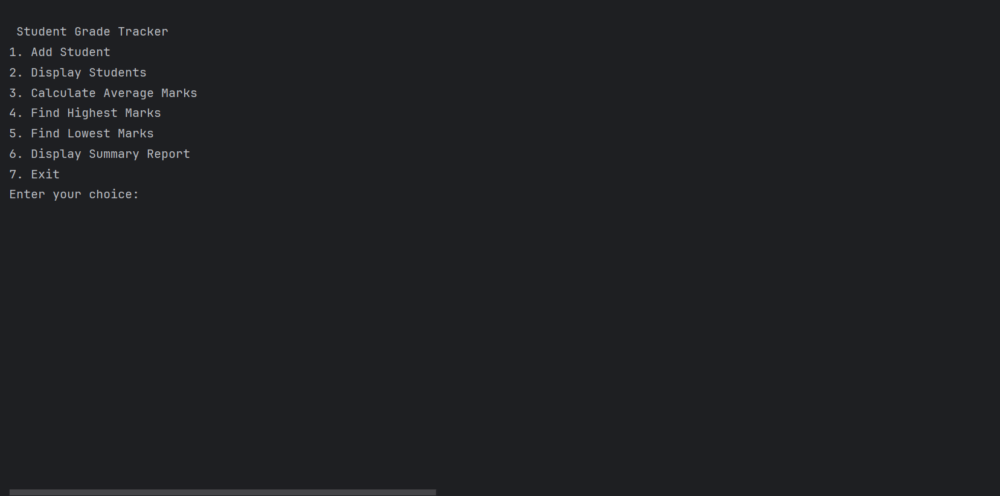
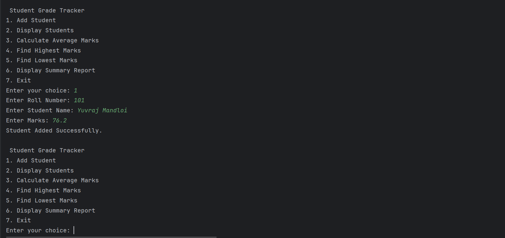
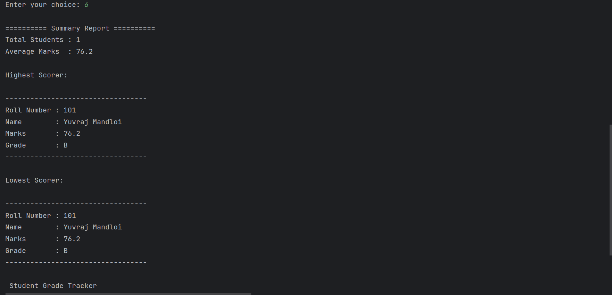

# Student Grade Tracker

Student Grade Tracker is a simple Core Java console application developed as part of my CodeAlpha Java Programming Internship.

The purpose of this project is to manage student records through a menu-driven console application. It allows users to add student details, calculate grades automatically, display all records, find the highest and lowest marks, calculate average marks, and generate a summary report.

While building this project, I improved my understanding of Object-Oriented Programming (OOP), Java Collections, and basic Git & GitHub workflow.

---

## Features

- Add a new student
- Display all student records
- Calculate average marks
- Find the highest scorer
- Find the lowest scorer
- Display a summary report
- Automatic grade calculation based on marks

---

## Technologies Used

- Java
- Object-Oriented Programming (OOP)
- ArrayList
- Scanner Class
- IntelliJ IDEA
- Git
- GitHub

---

## Project Structure

```
CodeAlpha_StudentGradeTracker
│
├── screenshots
│   ├── menu.png
│   ├── add-student.png
│   └── summary-report.png
│
├── src
│   ├── Main.java
│   └── Student.java
│
├── README.md
├── .gitignore
└── CodeAlpha_StudentGradeTracker.iml
```

### Main.java
Handles the complete application flow including menu options and user interaction.

### Student.java
Represents a student object and contains the logic for storing student details and calculating grades.

---

## How to Run

1. Clone this repository.

```bash
git clone https://github.com/yuvimandloi/CodeAlpha_StudentGradeTracker.git
```

2. Open the project in IntelliJ IDEA.

3. Run the `Main.java` file.

4. Use the menu displayed in the console.

---

## Core Java Concepts Used

- Classes and Objects
- Constructors
- Encapsulation
- Methods
- this Keyword
- ArrayList
- Scanner Class
- Loops
- Switch Statement
- Conditional Statements

---

## Screenshots

### Main Menu



---

### Add Student



---

### Summary Report



---

## What I Learned

This project gave me practical experience with:

- Designing a menu-driven Java application
- Working with classes and objects
- Using ArrayList to store data
- Applying Object-Oriented Programming concepts
- Writing clean and organized code
- Managing a project using Git and GitHub
- Creating project documentation

---

## Future Improvements

Some features that can be added in future versions:

- Search student by roll number
- Update student details
- Delete student records
- Store data using file handling
- Connect with MySQL using JDBC
- Build a graphical interface using Java Swing or JavaFX

---

## Author

**Yuvraj Mandloi**

GitHub: https://github.com/yuvimandloi
